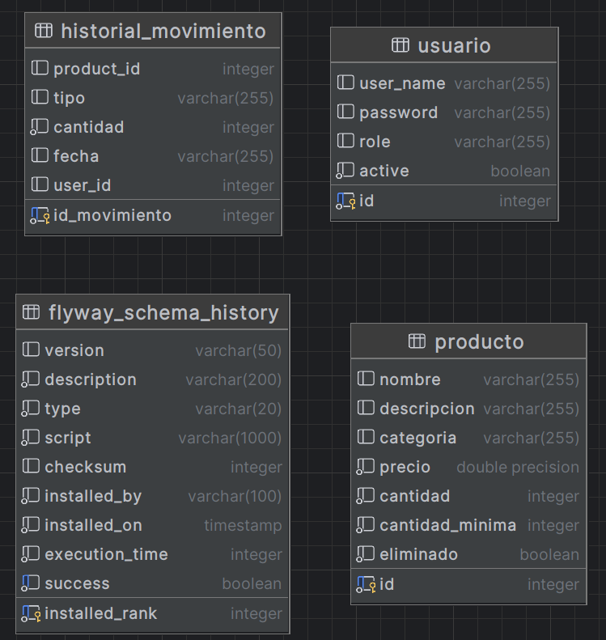

# Documentacion del proyecto
## Jorge Tuma y Aneury Estevez

## Requisitos Funcionales

1. **Gestión de Productos**
    - Agregar Producto: Permitir a los usuarios agregar nuevos productos al inventario.
    - Editar Producto: Permitir la edición de la información de un producto existente.
    - Eliminar Producto: Permitir la eliminación de productos del inventario.
    - Visualizar Productos: Mostrar una lista de todos los productos en el inventario con opciones de búsqueda y filtrado.

2. **Control de Stock**
    - Actualizar Stock: Permitir la actualización de la cantidad de productos en el inventario.
    - Control de Stock Mínimo: Alertar a los usuarios cuando la cantidad de un producto cae por debajo de un nivel mínimo establecido.
    - Historial de Movimientos: Mantener un registro de todas las entradas y salidas de productos.

3. **Integración con Otros Sistemas**
    - API de Integración: Proporcionar una API para integrar el sistema con otras aplicaciones.

4. **Interfaz de Usuario Amigable**
    - Dashboard: Proveer un tablero de control con una visión general del estado del inventario y estadísticas clave.
    - Usabilidad: Asegurar que la interfaz sea intuitiva y fácil de usar.

## Requisitos No Funcionales

1. **Seguridad**
    - Pruebas de Seguridad: Realizar pruebas de penetración y análisis de vulnerabilidades.
    - Autenticación y Autorización: Implementar OAuth2 y JWT para asegurar el acceso.

2. **Rendimiento**
    - Pruebas de Estrés: Evaluar el rendimiento del sistema bajo carga.
    - Pruebas de Compatibilidad: Asegurar la compatibilidad en diferentes navegadores y dispositivos.

3. **Calidad del Software**
    - Pruebas de Regresión: Implementar pruebas automatizadas para asegurar que las nuevas modificaciones no introduzcan errores.
    - Pruebas de Aceptación: Asegurar que el sistema cumple con los requisitos del usuario.

4. **Mantenibilidad**
    - Documentación Técnica: Incluir diagramas de arquitectura, guías de instalación y manuales de mantenimiento.
    - Pipeline de CI/CD: Configurar un pipeline robusto que incluya la construcción automática, pruebas y despliegue.

5. **Usabilidad**
    - Pruebas de Usabilidad: Evaluar la interfaz de usuario y la experiencia del usuario.
    - Pruebas de Navegadores: Realizar pruebas automatizadas en diferentes navegadores.

# Planificación  de Proyecto

## Plan de Proyecto
Para dar seguimiento a las tareas y metas del proyecto utilizamos Jira con la metodología SCRUM.
1. **Alcance**
    - Desarrollar un sistema de gestión de inventarios para reforzar conocimientos en QA.
    - Incluir funcionalidades de gestión de productos, control de stock y más.

2. **Objetivos**
    - Implementar un sistema que sea funcional, eficiente, seguro y fácil de usar.
    - Cumplir con  estándares de calidad, seguridad y usabilidad.

3. **Entregables**
    - Sistema de gestión de inventarios funcional.
    - Documentación técnica y de usuario.
    -  pruebas de calidad.

4. **Cronograma (Asumiendo un mes de trabajo aproximadamente)**
    - **Semana 1:** Análisis de requisitos y planificación del proyecto.
    - **Semana 2:** Diseño de la arquitectura del sistema.
    - **Semana 3:** Desarrollo de la aplicación.
    - **Semana 4:** Pruebas de QA y entrega.

## Gestión de Riesgos

1. **Identificación de Riesgos**
    - Retrasos en el cronograma.
    - Fallos en la integración de sistemas.
    - Problemas de seguridad y vulnerabilidades.
    - Dificultades en la usabilidad y experiencia del usuario.

2. **Estrategias de Mitigación**
    - **Retrasos en el Cronograma:** Realizar revisiones periódicas del progreso.
    - **Fallos en la Integración:** Realizar pruebas de integración continuas y documentar interfaces claramente.
    - **Problemas de Seguridad:** Implementar pruebas de seguridad regulares y actualizaciones de seguridad.
    - **Dificultades en la Usabilidad:** Realizar pruebas de usabilidad con usuarios finales.

# Documentación Técnica

La aplicación sigue una arquitectura basada en MVC Web.

Tecnologías Implementada 
1. Backend
Spring Boot: Framework para el desarrollo rápido de aplicaciones Java basadas en microservicios.
Spring Security con OAuth y JWT: Proporciona autenticación y autorización seguras.
Spring Data JPA: Abstracción para el acceso a datos con soporte para bases de datos relacionales.
PostgreSQL: Base de datos relacional utilizada para almacenar información de productos, movimientos de stock y usuarios.

2.  Frontend
Freemarker: Motor de Plantillas para renderizar vistas HTML.
Chart.js: Librería JavaScript para la visualización de datos en gráficos (usada en la vista del Dashboard de estado de inventario).

3. Infraestructura y CI/CD
Docker: Contenerización de la aplicación para un despliegue consistente.
Docker Compose: Orquestación de contenedores, facilitando la gestión y configuración de múltiples servicios.
GitHub Actions: CI/CD para automatización de pruebas y despliegues.

4. Pruebas
JUnit: Librería para realizar pruebas unitarias.
Playwright: Librería para realizar pruebas para navegadores.
Cuccumber: Librería para pruebas de aceptación.

5. Migraciones de BD
Flyway: Librería para realizar migraciones de base de datos.

## Guía de instalación y mantenimiento
Docker: Tener Docker instalado en el sistema.
Docker Compose: Incluido con Docker Desktop o instalable por separado.

Para arracncar todo el escenario ejecutaar en terminal el comando docker-compose up -d en el directorio del proyecto.
Al realizar cambios que requieran recompilar la aplicación docker-compose up -d --build

## Guía de Pruebas

###  Pruebas de Autenticación

####  Prueba de Inicio de Sesión Exitoso
- **ID del Caso de Prueba:** AU-001
- **Método de Prueba:** `testLogin`
- **Objetivo:** Verificar que un usuario puede iniciar sesión con credenciales válidas.
- **Precondiciones:** El usuario "admin" debe estar registrado.
- **Datos de Entrada:**
   - Usuario: "admin"
   - Contraseña: "admin"
- **Pasos:**
   1. Navegar a la página de inicio de sesión.
   2. Ingresar las credenciales válidas.
   3. Hacer clic en "Iniciar Sesión".
- **Resultado Esperado:** El usuario inicia sesión correctamente y se redirige a la página principal.
- **Resultado Real:** El usuario inició sesión exitosamente.
- **Estado:** ✅ Aprobado

####  Prueba de Inicio de Sesión Fallido
- **ID del Caso de Prueba:** AU-002
- **Método de Prueba:** `testFailLogin`
- **Objetivo:** Verificar que un usuario no puede iniciar sesión con credenciales inválidas.
- **Precondiciones:** El usuario "admin" debe estar registrado.
- **Datos de Entrada:**
   - Usuario: "admin"
   - Contraseña: "password" (incorrecta)
- **Pasos:**
   1. Navegar a la página de inicio de sesión.
   2. Ingresar credenciales inválidas.
   3. Hacer clic en "Iniciar Sesión".
- **Resultado Esperado:** Se muestra un mensaje de error indicando "Bad credentials".
- **Resultado Real:** Se mostró el mensaje de error "Bad credentials".
- **Estado:** ✅ Aprobado

####  Prueba de Cierre de Sesión
- **ID del Caso de Prueba:** AU-003
- **Método de Prueba:** `testLoginAndLogout`
- **Objetivo:** Verificar que un usuario puede cerrar sesión correctamente.
- **Precondiciones:** El usuario debe estar autenticado.
- **Datos de Entrada:** N/A
- **Pasos:**
   1. Iniciar sesión como "admin".
   2. Hacer clic en el enlace de "Logout".
- **Resultado Esperado:** El usuario es redirigido a la página de inicio de sesión.
- **Resultado Real:** El usuario fue redirigido correctamente a la página de inicio de sesión.
- **Estado:** ✅ Aprobado

###  Pruebas de Gestión de Productos

####  Crear un Producto Exitosamente
- **ID del Caso de Prueba:** CP-001
- **Método de Prueba:** `testCreateProduct`
- **Objetivo:** Verificar que un producto puede ser creado correctamente.
- **Precondiciones:** El usuario debe estar autenticado como administrador.
- **Datos de Entrada:**
   - Nombre: "Test Product"
   - Precio: 10.99
   - Cantidad: 100
   - Descripción: "This is a test product."
   - Categoría: "Test Category"
   - Cantidad Mínima: 1
- **Pasos:**
   1. Abrir el modal para crear un producto.
   2. Completar los campos del formulario.
   3. Hacer clic en "Guardar".
- **Resultado Esperado:** El producto se crea y aparece en la lista de productos.
- **Resultado Real:** El producto se creó y se mostró en la lista de productos.
- **Estado:** ✅ Aprobado

####  Intentar Crear un Producto con Campos Vacíos
- **ID del Caso de Prueba:** CP-002
- **Método de Prueba:** `testCreateEmptyProduct`
- **Objetivo:** Verificar que no se puede crear un producto sin completar los campos obligatorios.
- **Precondiciones:** El usuario debe estar autenticado como administrador.
- **Datos de Entrada:** Campos vacíos.
- **Pasos:**
   1. Abrir el modal para crear un producto.
   2. Hacer clic en "Guardar" sin llenar los campos.
- **Resultado Esperado:** Se muestran mensajes de error indicando que los campos son obligatorios.
- **Resultado Real:** Los mensajes de error se mostraron correctamente.
- **Estado:** ✅ Aprobado

####  Crear un Producto con Precio Negativo
- **ID del Caso de Prueba:** CP-003
- **Método de Prueba:** `testCreateProductWithNegativePrice`
- **Objetivo:** Verificar que no se puede crear un producto con un precio negativo.
- **Precondiciones:** El usuario debe estar autenticado como administrador.
- **Datos de Entrada:**
   - Nombre: "Test Product Negative Price"
   - Precio: -10.99 (negativo)
   - Cantidad: 100
   - Descripción: "This is a test product with a negative price."
   - Categoría: "Test Category"
   - Cantidad Mínima: 1
- **Pasos:**
   1. Abrir el modal para crear un producto.
   2. Ingresar un precio negativo y completar los demás campos.
   3. Hacer clic en "Guardar".
- **Resultado Esperado:** Se muestra un mensaje de error indicando que el precio no puede ser negativo.
- **Resultado Real:** El mensaje de error se mostró correctamente.
- **Estado:** ✅ Aprobado

####  Crear un Producto con Cantidad Negativa
- **ID del Caso de Prueba:** CP-004
- **Método de Prueba:** `testCreateProductWithNegativeQuantity`
- **Objetivo:** Verificar que no se puede crear un producto con una cantidad negativa.
- **Precondiciones:** El usuario debe estar autenticado como administrador.
- **Datos de Entrada:**
   - Nombre: "Test Product Negative Quantity"
   - Precio: 10.99
   - Cantidad: -100 (negativa)
   - Descripción: "This is a test product with a negative quantity."
   - Categoría: "Test Category"
   - Cantidad Mínima: 1
- **Pasos:**
   1. Abrir el modal para crear un producto.
   2. Ingresar una cantidad negativa y completar los demás campos.
   3. Hacer clic en "Guardar".
- **Resultado Esperado:** Se muestra un mensaje de error indicando que la cantidad no puede ser negativa.
- **Resultado Real:** El mensaje de error se mostró correctamente.
- **Estado:** ✅ Aprobado

####  Actualizar un Producto
- **ID del Caso de Prueba:** CP-005
- **Método de Prueba:** `testUpdateProduct`
- **Objetivo:** Verificar que un producto existente puede ser actualizado correctamente.
- **Precondiciones:** El producto debe existir en el inventario.
- **Datos de Entrada:**
   - Nombre Nuevo: "Product Updated"
- **Pasos:**
   1. Abrir el modal para modificar el producto.
   2. Actualizar el nombre del producto.
   3. Hacer clic en "Guardar".
- **Resultado Esperado:** El producto se actualiza en la base de datos y se muestra el nuevo nombre en la lista de productos.
- **Resultado Real:** El producto se actualizó correctamente.
- **Estado:** ✅ Aprobado

####  Eliminar un Producto
- **ID del Caso de Prueba:** CP-006
- **Método de Prueba:** `testDeleteProduct`
- **Objetivo:** Verificar que un producto puede ser eliminado correctamente del inventario.
- **Precondiciones:** El producto debe existir en el inventario.
- **Datos de Entrada:** N/A
- **Pasos:**
   1. Abrir el modal de confirmación para eliminar un producto.
   2. Confirmar la eliminación.
- **Resultado Esperado:** El producto se elimina y ya no aparece en la lista de productos.
- **Resultado Real:** El producto se eliminó correctamente.
- **Estado:** ✅ Aprobado

###  Pruebas de Gestión de Usuarios

####  Crear un Usuario Exitosamente
- **ID del Caso de Prueba:** CU-001
- **Método de Prueba:** `testCreateUsuario`
- **Objetivo:** Verificar que un nuevo usuario puede ser creado correctamente.
- **Precondiciones:** El usuario debe estar autenticado como administrador.
- **Datos de Entrada:**
   - Usuario: "newuser"
   - Contraseña: "password123"
   - Rol: "ROLE_USER"
- **Pasos:**
   1. Abrir el modal para crear un usuario.
   2. Completar los campos del formulario.
   3. Hacer clic en "Guardar".
- **Resultado Esperado:** El usuario se crea y aparece en la lista de usuarios.
- **Resultado Real:** El usuario se creó correctamente.
- **Estado:** ✅ Aprobado

#### 2.3.2. Intentar Crear un Usuario con Campos Vacíos
- **ID del Caso de Prueba:** CU-002
- **Método de Prueba:** `testCreateEmptyUsuario`
- **Objetivo:** Verificar que no se puede crear un usuario sin completar los campos obligatorios.
- **Precondiciones:** El usuario debe estar autenticado como administrador.
- **Datos de Entrada:** Campos vacíos.
- **Pasos:**
    1. Abrir el modal para crear un usuario.
    2. Hacer clic en "Guardar" sin llenar los campos.
- **Resultado Esperado:** Se muestran mensajes de error indicando que los campos son obligatorios.
- **Resultado Real:** Los mensajes de error se mostraron correctamente.
- **Estado:** ✅ Aprobado

#### 2.3.3. Actualizar un Usuario
- **ID del Caso de Prueba:** CU-003
- **Método de Prueba:** `testUpdateUsuario`
- **Objetivo:** Verificar que un usuario existente puede ser actualizado correctamente.
- **Precondiciones:** El usuario debe existir en el sistema.
- **Datos de Entrada:**
    - Usuario Nuevo: "updateduser"
- **Pasos:**
    1. Abrir el modal para modificar el usuario.
    2. Actualizar el nombre de usuario.
    3. Hacer clic en "Guardar".
- **Resultado Esperado:** El usuario se actualiza en la base de datos y se muestra el nuevo nombre en la lista de usuarios.
- **Resultado Real:** El usuario se actualizó correctamente.
- **Estado:** ✅ Aprobado

#### 2.3.4. Eliminar un Usuario
- **ID del Caso de Prueba:** CU-004
- **Método de Prueba:** `testDeleteUsuario`
- **Objetivo:** Verificar que un usuario puede ser eliminado correctamente del sistema.
- **Precondiciones:** El usuario debe existir en el sistema.
- **Datos de Entrada:** N/A
- **Pasos:**
    1. Abrir el modal de confirmación para eliminar un usuario.
    2. Confirmar la eliminación.
- **Resultado Esperado:** El usuario se elimina y ya no aparece en la lista de usuarios.
- **Resultado Real:** El usuario se eliminó correctamente.
- **Estado:** ✅ Aprobado

### 2.4. Pruebas de Gestión de Stock

#### 2.4.1. Incrementar Stock de un Producto
- **ID del Caso de Prueba:** CS-001
- **Método de Prueba:** `testIncrementProductStock`
- **Objetivo:** Verificar que se puede incrementar el stock de un producto.
- **Precondiciones:** El producto debe existir en el inventario.
- **Datos de Entrada:**
    - Cantidad a Incrementar: 5
- **Pasos:**
    1. Abrir el modal para incrementar stock.
    2. Ingresar la cantidad a incrementar.
    3. Hacer clic en "Incrementar".
- **Resultado Esperado:** El stock del producto se incrementa en 5 unidades.
- **Resultado Real:** El stock se incrementó correctamente.
- **Estado:** ✅ Aprobado

#### 2.4.2. Decrementar Stock de un Producto
- **ID del Caso de Prueba:** CS-002
- **Método de Prueba:** `testDecrementProductStock`
- **Objetivo:** Verificar que se puede decrementar el stock de un producto.
- **Precondiciones:** El producto debe tener suficiente stock disponible.
- **Datos de Entrada:**
    - Cantidad a Decrementar: 3
- **Pasos:**
    1. Abrir el modal para decrementar stock.
    2. Ingresar la cantidad a decrementar.
    3. Hacer clic en "Decrementar".
- **Resultado Esperado:** El stock del producto se decrementa en 3 unidades.
- **Resultado Real:** El stock se decrementó correctamente.
- **Estado:** ✅ Aprobado

### 2.5. Pruebas de Visualización

#### 2.5.1. Visualizar el Historial de Movimientos
- **ID del Caso de Prueba:** VH-001
- **Método de Prueba:** `testHistorialView`
- **Objetivo:** Verificar que se puede visualizar correctamente el historial de movimientos.
- **Precondiciones:** El usuario debe estar autenticado como administrador.
- **Datos de Entrada:** N/A
- **Pasos:**
    1. Navegar a la página del historial de movimientos.
- **Resultado Esperado:** El historial de movimientos se muestra correctamente.
- **Resultado Real:** El historial se mostró correctamente.
- **Estado:** ✅ Aprobado

#### 2.5.2. Visualizar el Dashboard
- **ID del Caso de Prueba:** VH-002
- **Método de Prueba:** `testViewDashboard`
- **Objetivo:** Verificar que se puede visualizar correctamente el dashboard.
- **Precondiciones:** El usuario debe estar autenticado como administrador.
- **Datos de Entrada:** N/A
- **Pasos:**
    1. Navegar a la página del dashboard.
- **Resultado Esperado:** El dashboard se muestra correctamente con gráficos y estadísticas.
- **Resultado Real:** El dashboard se mostró correctamente.
- **Estado:** ✅ Aprobado